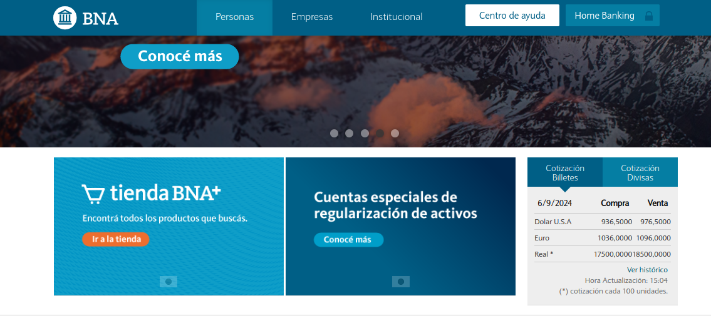

**Web Scraper de Cotizaciones** 

Este proyecto extrae cotizaciones del Dólar, Euro y Real desde el sitio del Banco Nación (https://www.bna.com.ar/Personas) y guarda los datos en un CSV con la hora exacta de la extracción, repitiendo cada segundo.

Ejecutar con Docker Compose:

docker-compose up --build

Archivos CSV
Se guardan en ./exchange con el formato exchange_rates_YYYYMMDD_HHMMSS.csv.

